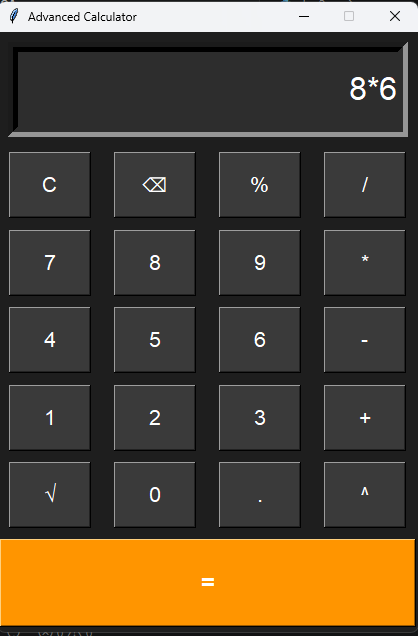

```markdown


# Advanced Calculator

A simple calculator application built using Python and Tkinter.

## Features

- Basic arithmetic operations (+, -, *, /)
- Percentage calculations
- Square root calculations
- Power operator (^)
- Backspace support
- Keyboard input support
- Dark mode interface

## Technologies Used

- Python
- Tkinter
- Math Module

## How to Run

1. Clone the repository
2. Open the project folder
3. Run:

```bash
python day2.py
